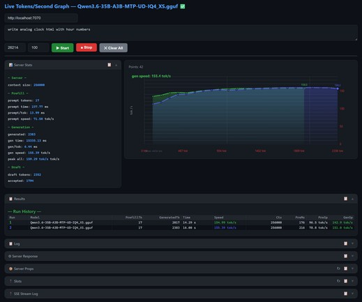

# test-speed-graph — Live Tokens/Second Graph for llama-server

> A real-time visualization tool for monitoring token generation speed (tok/s) against [llama.cpp](https://github.com/ggerganov/llama.cpp) HTTP API (`llama-server`).

[](#license)
[]()

## Screenshots



## Features

- **Live Tok/s Chart** — Canvas-based real-time graph showing token generation speed over the course of generation
- **Multi-run Comparison** — Each generation adds a new colored line to the chart; previous runs are preserved until you click "Clear All"
- **Server Stats Dashboard** — Pre-fill metrics, generation speed, peak speed, context fill %, draft tokens, and cache size
- **Run History Table** — Tracks every generation session with token counts, timing, speed, and context fill percentage
- **SSE Stream Inspector** — Detailed raw Server-Sent Events log table showing every timing field from the server
- **Health & Model Detection** — Auto-detects server model name from `/health` and `/v1/models` endpoints
- **Server Props & Slots** — Inspect `llama-server` configuration and active KV-cache slots
- **Dark Theme** — GitHub-inspired dark UI with collapsible panels and persistent state (via `localStorage`)


## Quick Start

### Prerequisites

- A running [llama-server](https://github.com/ggerganov/llama.cpp/tree/master/examples/server) instance
  ```bash
  llama-server --model <model.gguf> --host 127.0.0.1 --port 7070
  ```

### Usage

1. **Open** `index.html` in a browser
2. **Enter** the server URL (defaults to `http://localhost:7070`)
3. **(Optional)** Adjust settings:
   - **Max Tokens** — maximum tokens to generate (default: 262144)
   - **Update Interval** — graph update frequency in tokens (default: 100)
4. **Type** a prompt in the textarea
5. **Click** `▶ Start` to begin generation
6. **Watch** the live chart update in real-time

The graph will accumulate colored lines for each generation session. Click `✕ Clear All` to reset everything.

## Architecture

```
graph-tgs/
├── index.html              # Entry point — layout, controls, collapsible panels
├── styles.css              # Styling — dark theme, GitHub-inspired design
├── js/
│   ├── app.js              # Core logic — stream processing, speed computation, UI orchestration
│   ├── chart.js            # Canvas chart rendering — grid, axes, colored run lines & areas
│   ├── speed.js            # Token speed calculation — handles llama-server timing quirks
│   ├── state.js            # Global state management — SSE helpers, slots polling, context fill
│   ├── ui.js               # UI helpers — progress bar, server stats, logging, response panels
│   ├── runTable.js         # Run history table rendering
│   ├── clearAll.js         # Full state reset handler
│   ├── health.js           # /health and /v1/models endpoint handlers
│   ├── props.js            # /props endpoint handler — server configuration display
│   └── slots.js            # /slots endpoint handler — active KV-cache slot display
├── logs/                   # Debug logs
└── _/                      # Build archives / backups
```

## API Integration

### Chat Completions (Streaming)

```http
POST /v1/chat/completions
Content-Type: application/json

{
    "model": "any",
    "messages": [{"role": "user", "content": "Your prompt here"}],
    "max_tokens": 262144,
    "stream": true,
    "return_progress": true,
    "timings_per_token": true
}
```

### Health & Info Endpoints

| Endpoint | Method | Purpose |
|----------|--------|---------|
| `/health` | GET | Server health, model name |
| `/v1/models` | GET | List available models |
| `/props` | GET | Server configuration properties |
| `/slots` | GET | Active KV-cache slots |

### SSE Response Format

```json
{
    "choices": [{"delta": {"content": "..."}}],
    "timings": {
        "prompt_n": 5,
        "prompt_ms": 100,
        "predicted_n": 1500,
        "predicted_per_second": 42.5
    },
    "prompt_progress": {
        "processed": 5,
        "total": 5
    }
}
```

## Key Implementation Details

### Speed Calculation

The tool handles several quirks specific to `llama-server`'s timing API:

- **Chunk 1-2**: `predicted_n` reflects a token budget (not actual count)
- **Chunk 3**: `predicted_n` resets to 0 after prefill completes
- **Subsequent chunks**: Incremental true token counts (1, 6, 11, 17, ...)

The speed calculator tracks `prevPredictedN` to detect real token deltas and uses a three-level fallback system to compute accurate tok/s values.

### Multi-run Chart

- Each generation run is assigned a persistent color from a 12-color palette
- Chart points accumulate across runs — old lines remain visible
- The Y-axis scale is based on the global maximum speed across **all** runs, so no line ever gets pushed off-screen
- Click **Clear All** to reset everything

### Context Fill Monitoring

When the server is idle (not generating), the tool polls `/slots` to monitor KV-cache context fill percentage, shown in the progress bar. This helps visualize how much context the loaded model is consuming.

## Browser Compatibility

- Works in any modern browser (Chrome, Firefox, Edge, Safari)
- No build step, no dependencies — just open `index.html`
- Requires JavaScript (ES6+)

## License

MIT
